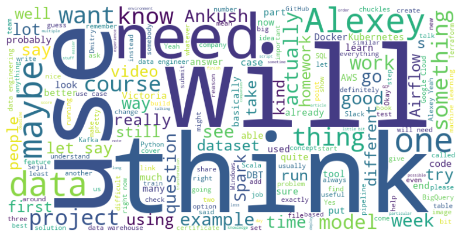
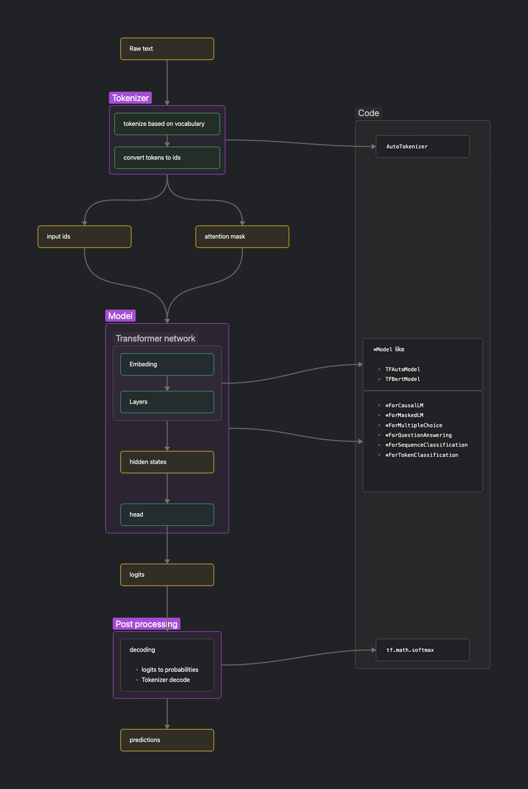

# DTC Zoomcamp Q&A Challenge (Second Capstone Project)

## Problem description
The aim of this project is to answer questions related to [data engineering zoomcamp](https://github.com/DataTalksClub/data-engineering-zoomcamp/)and [machine learning zoomcamp](https://github.com/DataTalksClub/machine-learning-zoomcamp) base on this [dataset in kaggle](https://www.kaggle.com/competitions/dtc-zoomcamp-qa-challenge/overview).

<div style="text-align: center;">
    
</div>

the data which is being used to train the model can be found [here](./data/). NLP packages from [huggingface transformers](https://huggingface.co/docs/transformers/index) were also used in order to train the model. the schema of the input data is as follows:

questions:
|column name|type|description|
|---|---|---|
|question_id|`int`|id of the question|
|question|`text`|text of the question|
|course|`enum`|one of `Machine Learning Zoomcamp` and `Data Engineering Zoomcamp`|
|year|`int`|one of `2021` and `2022`|
|candidate_answers|`array[int]`|a list of candidate answers ids|
|answer_id|`int`|the coorect answer id|

---

answers:
|column name|type|description|
|---|---|---|
|answer_id|`int`|id of the answer|
|answer|`text`|text of the answer|
|course|`enum`|one of `Machine Learning Zoomcamp` and `Data Engineering Zoomcamp`|
|year|`int`|one of `2021` and `2022`|
|attachement_files|`null`\|`text`|the name of the attached file|
---
Also the exposed API of the model is as follows:

request:
```
GET http://localhost:5678/ask/?question={question_text}&course_name={course_name}&max_num_answers={maximum_number_of_answers}
```
---
respose
```
{
    'answers': [
        answer1,
        answer2,
        answer3
    ]
}
```


## EDA
> - [eda](/eda.ipynb)


## Model training
> - [input data prepration](./data-prepration.ipynb)
> - [model training](./happy-path.ipynb)
> - [model prediction](./predict.ipynb)
### structure of transformer models



## Exporting notebook to script
> - [input data prepration](./py_scripts/data_prepration.py)
> - [train script](./py_scripts/train.py)
> - [model interface](./py_scripts/model_interface.py)

## Model deployment
> - [flask api server](./py_scripts/api_server.py)

## Dependency and enviroment management
1. Clone the project from github:
```
git clone https://github.com/shayansm2/kaggle-playground.git
```
2. Go to the directory for capstone project 2:
```
cd dtc-zoomcamp-qa-challenge/
```
3. Create a new conda environment from a requirements file:
```
conda create --name capstone_project_2 --file requirements.txt
```
4. Activate the conda environment:
```
conda activate capstone_project_2
```
5. Install ipykernel (for running jupyter notebooks):
```
conda install -c conda-forge ipykernel
```
> - [requirements](./requirements.txt)
> - [deployment requirements](./requirements_deployment.txt)

## Containerization
1. build the image from Dockerfile
```
docker build -t capstone_project_2 ./
```
2. build a container from the image and run it
```
docker run -it -p 5678:5678 capstone_project_2
```
> - [dockerfile](./Dockerfile)

## Resources
- [Huggingface NLP course](https://huggingface.co/learn/nlp-course/chapter1/1)
- [DTC Zoomcamp Q&A Challenge
](https://www.kaggle.com/competitions/dtc-zoomcamp-qa-challenge/overview)